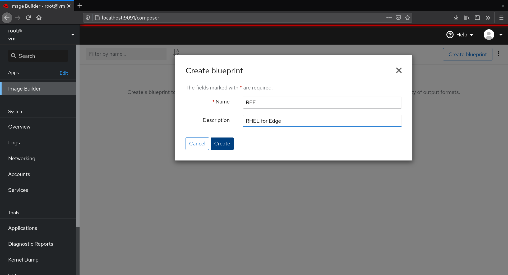
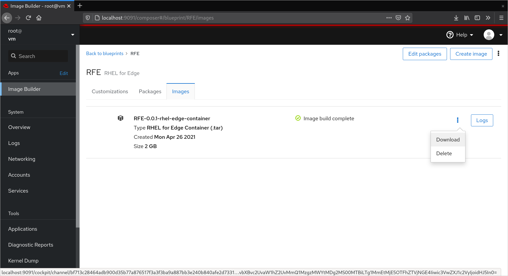

# Building RHEL for Edge with Image Builder

This demonstrates the use of [Image Builder](https://www.osbuild.org/) to
create a (custom) RHEL for Edge [OSTree](https://ostree.readthedocs.io/en/latest/)
commit and how to install those to a disk or a virtual machine image.

## Requirements

Image Builder is available via [RHEL 8.3](https://access.redhat.com/pilot-documentation/red_hat_enterprise_linux/8).
The *KVM Guest Image* is used to install Image Builder and build a
RHEL for Edge commit.
The *Boot ISO* is then used to install that commit.

Name            | Filename
----------------|-------------------------
Boot ISO        | rhel-8.3-x86_64-boot.iso
KVM Guest Image | rhel-8.3-x86_64-kvm.qcow2


## Install Image Builder

### Run RHEL inside a virtual machine

A small helper script is used to start the RHEL 8.3 Guest Image. It uses
[cloud-init](https://cloudinit.readthedocs.io/en/latest/) to provision a
`root` user (password `r`). The script also enables port forwarding for
the ssh and web console ports (`22` → `2222` (host) and
`9090` → `9091`).

```
vm --persist rhel-8.3-beta-1-x86_64-kvm.qcow2
```

### Register the system

To be able to install packages the VM must be registered via:

```
subscription-manager register --username <redhat_login_username> --password <redhat_login_password>
subscription-manager role --set="Red Hat Enterprise Linux Server"
subscription-manager service-level --set="Self-Support"
subscription-manager usage --set="Development/Test"
subscription-manager attach
```

### Install Image Builder

```
yum install osbuild-composer cockpit-composer
```

### Enable web console
The Image Builder front end is a plugin to the web console (*cockpit*),
which needs to be enabled.
```
systemctl enable --now cockpit.socket
```

## Build a RHEL for Edge commit

Navigate to the web console via a browser on the host. URL: http://localhost:9091
There, *Image Builder* is found under *Apps* in the right menu.
Images, or in our case,commits, are generated from so called *Blueprints*,
which are customizations that are applied to existing *Image Types*,
e.g. "RHEL for Edge commit". Internally there is a queue that will
distribute compose requests to workers, which in turn are building the
commits / images. The UI flow is as follows:

 1. Activate the Image Builder service.
 2. Create a Blueprint 
 3. Customization: add packages 
 4. Create the commit 
 5. Wait for the build to finish
 6. Tarball with the commit is ready to download 

### Build via the command line

Commits can also build from the command line, via the help of
the `composer-cli` tool (`yum install composer-cli`).

A new blueprint is created from a TOML file, e.g. [`blueprint.toml`](blueprint.toml):

```
$> composer-cli blueprints push blueprint.toml
```

From this a compose is created for the previously created blueprint
(`Edge`). The type of the compose here is `rhel-edge-commit`. The
UUID if the compose can later be used to obtain the artifact.

```
$> composer-cli compose start-ostree Edge rhel-edge-commit "" ""
Compose <uuid> added to the queue
```

The status of a compose can be inspected via:

```
$> composer-cli compose status
<uuid> RUNNING  Thu Jul 30 09:36:14 2020 Edge            0.0.1 rhel-edge-commit
```

Finally the commit can be downloaded via
```
$> composer-cli compose image <uuid>
<uuid>-commit.tar: 633.73 MB
```

## Inspect the commit

Extract the downloaded tarball via `tar xvf <uuid>-commit.tar`. It should
contain a `compose.json` and a `repo` directory. The former contains the
metadata about the commit, like the "Ref" (`ref`) and the commit id
(`ostree-commit`). The `repo` folder is a OSTree repository that contains
the commit.
The `ostree` and `rpm-ostree` commands can be used to inspect the contents:
The list of rpm packages included in the commit can be listed via
```
# print a list of packages in the commit
rpm-ostree db list rhel/8/x86_64/edge --repo=repo
```

## Install the commit

### Setup a webserver

In order to fetch the commit from the (generic) installer, it needs to be
served via HTTP. This can be done via a container that contains the OSTree
commit as well as a http server to serve it.

```
podman build -t edge-server --build-arg commit=<uuid>-commit.tar .
podman run --rm -p 8000:80 edge-server
```

### Install to a disk via Anaconda (Basic Example)

The installer, anaconda, on the `boot.iso` installation medium can
be used to install the commit. To configure the installer to use the
newly build commit, a "kickstart" configuration [`edge.ks`](edge.ks),
is used. It is setup for non-interactive, text-based installation.
The important line within the kickstart is the `ostreesetup` directive
which instructs the installer to fetch and deploy the commit.
Additionally a user `core` (pw: `edge`) is created.

For demonstration purposes we create an empty `qcow2` with a size of
`5G`, to act as the installation target:

```
qemu-img create -f qcow2 disk.qcow2 5G
```

The installer is run with qemu:
```
qemu-system-x86_64 \
  -m 2048 \
  -enable-kvm \
  -device virtio-net-pci,netdev=n0 \
  -netdev user,id=n0,net=10.0.2.0/24 \
  -drive file=disk.qcow2 \
  -cdrom rhel-8.3-x86_64-boot.iso
```

To use the prepared kicksstart file, instead of the default one of
the `boot.iso`, an additional kernel parameter is needed (hit `TAB`
on the `Install Red Hat Enterprise Linux 8.3` entry):

```
inst.ks=http://10.0.2.2:8000/edge.ks
```


As an alternative to supplying the kickstart location via the kernel
command line, the `mkksiso` (`lorax` package) can be used to inject
the kickstart file into the boot iso:

```
mkksiso edge.ks rhel-8.3-beta-1-x86_64-boot.iso boot.iso
```

### Updates

Updates are delivered in form of new commits. This provides one
of the most important features of OSTree: atomic and safe updates.
This means that an update of the system to a new commit will be
deployed either fully or not at all, even if the update process
gets interrupted. Additionally, the old state of the system, i.e.
the deployment of the old commit, is kept around. In case the new
update does not work as expected, it is easy to go back to the
old commit.

Creating a new update commit, which can include new versions of
packages or additional packages, is the same as creating a new
"image", in Image Builder terms, but with the commit id of the
current deployment (or commit) as the *parent*. On a booted system
the commit id can be found via `rpm-ostree status`.


After the new commit is built, it needs to be served via http,
very much like the initial commit above. Then the system can
be updated via

```
rpm-ostree update
```

This will create a new deployment of the new commit. A reboot, via
`systemctl reboot`, is all that is necessary to boot into that
new deployment.
If something in the new deployment is not as it should be, the old
deployment can be restored via `rpm-ostree rollback`.

## Alternative Install using the Second Kickstart Example

The second kickstart example, [`edge2.ks`](edge2.ks), will install the
 same ostree commit as well as demonstrate the use of a few features in 
`%post` that makes the OS much easier to manage when using a large 
fleet of systems. To use this example simply adjust the kickstart 
being used:
```
inst.ks=http://10.0.2.2:8000/edge2.ks
```

### Nodes will automatically stage ostree updates
As new OStree commits are created via Image Builder and made 
avaialable, clients will stage the updates locally. Enable staging 
by setting `AutomaticUpdatePolicy=stage` in `/etc/rpm-ostreed.conf`.
 The `rpm-ostreed-automatic.timer` will also need to be enabled as
 shown in the example.

### Manage containers as a system service
Containers are an ideal vehicle to help minimize "patch Tuesday" 
style problems, thus making the this means of application 
packaging perfect for long life devices deployed outside of 
traditional data centers. Podman natively supports systemd as a 
manager and this results in one of the lightest weight solutions 
for running containers. The boinc example container shows a 
modified unit file generated by `podman generate systemd`. systemd 
will ensure the `container-boinc.service` is running at startup 
and in the case that it fails at runtime, automatically restarted 
via `Restart=on-failure`. This same concept can apply to multiple 
containers and/or pods.

### Automatically update Containers
Podman has recently implemented the ability to automatically update 
containers. The example includes the label 
`io.containers.autoupdate=image` to notify Podman that it should be 
running the latest image with the defined tag. systemd timers are 
included to schedule this operation.

### systemd timers are used for local actions and maintenance windows
Timers are very similar to chron jobs, but also offer some amazing 
features that benefit this use case. Essentially they're managed like 
any other systemd unit file and the details for options can be found 
[here.](https://www.freedesktop.org/software/systemd/man/systemd.timer.html) 
```
$ systemctl list-timers
NEXT                         LEFT     LAST                         PASSED       UNIT                         ACTIVATES
Thu 2020-09-03 00:42:57 UTC  21h left Wed 2020-09-02 00:08:54 UTC  3h 30min ago podman-auto-update.timer     podman-auto-update.service
Thu 2020-09-03 01:30:00 UTC  21h left n/a                          n/a          applyupdate.timer            applyupdate.service
Thu 2020-09-03 03:00:07 UTC  23h left Wed 2020-09-02 03:00:07 UTC  39min ago    rpm-ostreed-automatic.timer  rpm-ostreed-automatic.service
```

#### Splaying events
Some actions like downloading an OS update or a container image should 
ideally use some type of *splay* to ensure that a reasonable load is 
placed on the registry and ostree mirror. Using RandomizedDelaySec=86400 
will randomize the timer across a 24 hour period. This is a highly 
effect approach for events that are not time sensative and when it 
is desireable to spread the load to conserve backend resources.

#### When not to splay
For events like applying OS updates, it's best to carefully target a 
maintenance window to ensure the SLA is met and the downtime is very 
minimal and predictible. The provided example will apply updates 
nighly at 1:30 UTC (OnCalendar=*-*-* 01:30:00). A more realistic example 
might follow a weekly maintenance window on Sunday nights 
(OnCalendar=Sun *-*-* 00:00:00). 

## Final Thoughts
When nodes are deployed in numbers ranging from 10s of thousands into 
the millions, we need to think differently about how we interact with 
the fleet. Also as connectivity increases with systems and devices, the
importance of keeping everything updated while minimizing downtime and 
application disruptions also become critical. The example kickstarts 
demonstrate how to configure nodes to automatically stay current on
available updates. These concepts can be built upon and adapted for 
many other use cases. 
